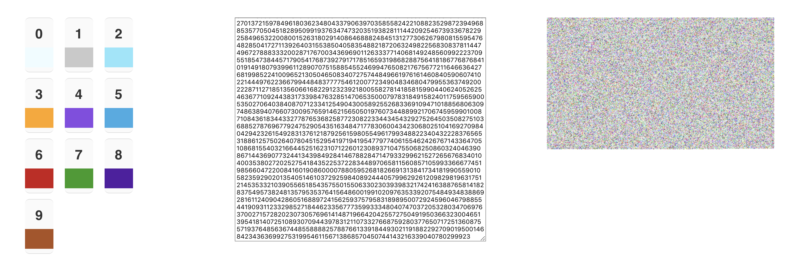

# Synesthete

I wanted to play around with WebAssembly and Rust and I wanted this to be my first project that uses it.

Synesthete is a way to visualize numbers as colors, which is the type of synesthesia I have. You can assign each digit (0 - 9) a number, enter some numbers in the input, and see how it would look rendered as the colors you chose.

Currently, the best use case is for large inputs greater than 5,000 numbers.

## Example

The first 500,000 digits of pi in the colors I see.

## Stack

- **Front-end**: Javascript (React)
- **Back-end**: Rust, WebAssembly
- **Data Storage**: Local Storage

## Todo

- Play around with `fillRect()` instead of `putImageData()` so the drawn colors are bigger
- Clean up my React components
- Clean up Rust code and see if I can make it more efficient
- Make it prettier
